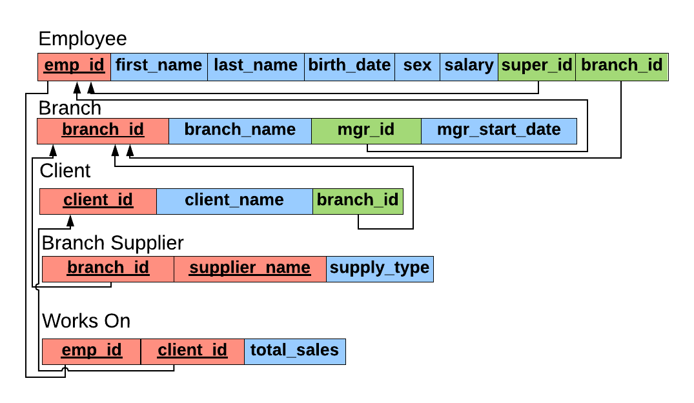

# fcc-sql-db-course
- Coding along with the freeCodeCamp course [SQL Tutorial - Full Database Course for Beginners](https://www.youtube.com/watch?v=HXV3zeQKqGY)
- Website: [Giraffe Academy - SQL](https://www.giraffeacademy.com/databases/sql/)
- Used MySQL / MySQL Workbench

## Company Info


## ER Diagram (Entity Relationship)
- Requirements in English --> ER diagram --> database schema


## Database Schema


## Notes
- IMPORTANT: This focuses mostly on queries (what I'd have access to).  For create, update, delete, triggers, database design, see individual .sql files
- DBMS (Database Management System) - Special software that helps users create and maintain a database.  Relational databases uses tables.
- SQL (Structured Query Language) - Language used to interact with RDBMS
- Primary key is UNIQUE and NOT NULL (column that uniquely identifies each row)
  - Composite key - Primary key that uses multiple columns
- Foreign key is a primary key in another table
- List all tables: `SHOW TABLES;`
- Shows table structure, fields, datatypes, keys: `DESCRIBE <table>;`
- Basic queries:
  - ```
    SELECT name, major                              (List desired columns)
    FROM student                                    (Specify table)
    WHERE major <> 'Chemistry' AND student_id > 2   (Multiple filters)
    ORDER BY name DESC                              (Descending order)
    LIMIT 2;                                        (Top 2 results)
    ```
  - ```
    SELECT *
    FROM student
    WHERE name IN ('Claire', 'Kate', 'Mike');       (Specify list of names)
    ```
- Date format is 'YYYY-MM-DD'
- AS - Rename columns:
  - `SELECT last_name AS surname FROM employee;`
- DISTINCT - Find unique values in a column:
  - `SELECT DISTINCT sex FROM employee;`
- COUNT() - Count number of entries (NULL is excluded)
  - `SELECT COUNT(emp_id) from employee;`
- AVERAGE()
  - `SELECT AVG(salary) FROM employee;`
- SUM()
  - `SELECT SUM(salary) FROM employee;`
- GROUP BY (aggregation)
  - `SELECT COUNT(sex), sex FROM employee GROUP BY sex;`
  - `SELECT emp_id, SUM(total_sales) FROM works_with GROUP BY emp_id;`
- Wildcards:
  - `%` = any # characters
  - `_` = 1 character
  - Must use with LIKE keyword
    - `SELECT * FROM client WHERE client_name LIKE '%LLC%';`
- UNION: Combine results from multiple SELECT statements into the same column
  - Rules (for each select statement):
  - 		* Have same number of columns
  -      * Have similar data type
  - Uses the first select's column names, can rename using AS
  - Find a list of all clients & branch suppliers' names
    ```
    SELECT client_name, client.branch_id
    FROM client
    UNION
    SELECT supplier_name, branch_supplier.branch_id
    FROM branch_supplier;
    ```
- JOIN: Combine rows from multiple tables based on a related column
  - Types of JOINs:
    - JOIN (INNER JOIN) - Combines when both tables have the shared column in common
    - LEFT JOIN (LEFT OUTER JOIN) - All rows from left table are included, and the right table is populated with a value if it matches or NULL if it does not
    - RIGHT JOIN (RIGHT OUTER JOIN) - All rows from right table are included, and the left table is populated with a value if it matches, or NULL if it does not
    - FULL JOIN (FULL OUTER JOIN) - All rows from both left and right table are included, the other table will be populated with a value if it matches, or NULL if it does not
    - Shows all employee names.  Branch name is also shown if the employee is a manager.
    ```
    SELECT employee.emp_id, employee.first_name, branch.branch_name
    FROM employee
    LEFT JOIN branch
    ON employee.emp_id = branch.mgr_id;
    ```
- Subquery: Use result of one SELECT statement to inform the result of another SELECT statement
  - Pair with:
    - `IN` - Allows for multiple rows to be returned
    - `=` - Requires a single row to be returned, can guarantee by using LIMIT 1
    - Find all clients who are handled by the branch that Michael Scott manages
      ```
      SELECT client.client_name
      FROM client
      WHERE client.branch_id IN (
        SELECT branch.branch_id
          FROM branch
          WHERE branch.mgr_id = (
            SELECT employee.emp_id
            FROM employee
            WHERE employee.first_name = 'Michael' AND employee.last_name = 'Scott'
            LIMIT 1
          )
      );
      ```